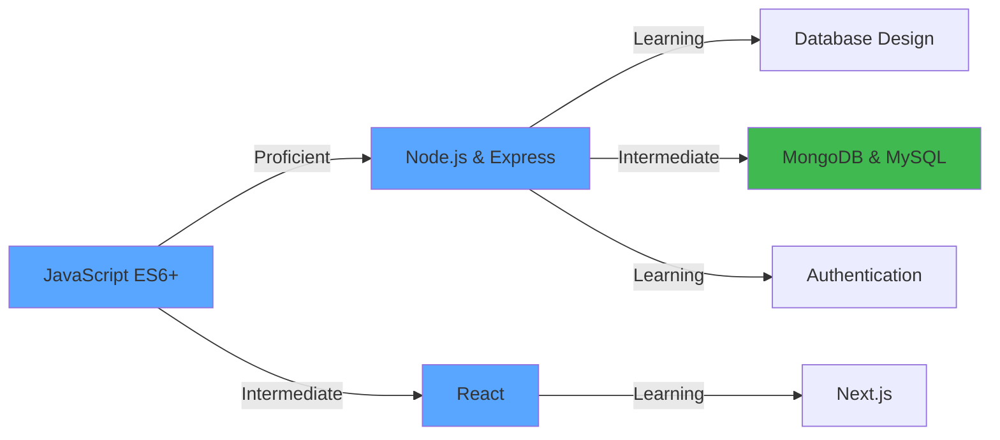

<div align="center">


<a href="https://git.io/typing-svg">
  
</a>

<p>
  
  
  
</p>

<p>
  <a href="https://www.linkedin.com/in/anand-mishra-a3a306225">
    
  </a>
  <a href="https://github.com/anand-242003">
    
  </a>
  <a href="mailto:anandmishra3001@gmail.com">
    
  </a>
</p>

</div>

<br/>

## About Me


```typescript
interface Developer {
  name: string;
  location: string;
  role: string;
  education: string;
  bootcamp: string;
  expertise: string[];
  currentFocus: string[];
  interests: string[];
}

const anand: Developer = {
  name: "Anand Mishra",
  location: "Sonipat, Haryana, India",
  role: "Backend Developer | Bootcamp Learner",
  education: "B.Tech in AI/ML (Year 2)",
  bootcamp: "Newton School Full-Stack Development",
  
  expertise: [
    "JavaScript & ES6+",
    "Node.js & Express.js",
    "React & Next.js",
    "MongoDB & Mongoose",
    "MySQL Database",
    "RESTful APIs & Middleware",
    "MERN Stack Development"
  ],
  
  currentFocus: [
    "Full-Stack Development",
    "Authentication & Security",
    "Database Design",
    "Building Real-World Projects",
    "Problem Solving & DSA"
  ],
  
  interests: [
    "Backend Engineering",
    "Fintech Applications",
    "Job Portal Development",
    "Cricket",
    "Open Source Contribution"
  ]
};
```

<br clear="right"/>

<br/>

## Tech Stack & Tools

<div align="center">

### Languages
<p>
  
</p>

### Backend & Frameworks
<p>
  
</p>

### Databases
<p>
  
</p>

### Frontend
<p>
  
</p>

### DevOps & Tools
<p>
  
</p>

### Authentication & Security
<p>
  
  
  
</p>

</div>

<br/>

## GitHub Analytics

<div align="center">

<a href="https://github.com/anand-242003">
  
  
</a>

<br/>

<a href="https://github.com/anand-242003">
  
</a>

</div>

<br/>

## Skill Progression

<div align="center">



</div>

<table>
<tr>
<th>Skill Category</th>
<th>Technologies</th>
<th>Proficiency</th>
</tr>
<tr>
<td><strong>JavaScript</strong></td>
<td>ES6+, Async/Await, Promises</td>
<td><code>████████░░</code> 80%</td>
</tr>
<tr>
<td><strong>Backend Development</strong></td>
<td>Node.js, Express.js</td>
<td><code>███████░░░</code> 70%</td>
</tr>
<tr>
<td><strong>Frontend</strong></td>
<td>React, Next.js</td>
<td><code>██████░░░░</code> 60%</td>
</tr>
<tr>
<td><strong>Database</strong></td>
<td>MongoDB, MySQL</td>
<td><code>██████░░░░</code> 60%</td>
</tr>
<tr>
<td><strong>API Development</strong></td>
<td>REST APIs, Middleware</td>
<td><code>███████░░░</code> 70%</td>
</tr>
<tr>
<td><strong>Version Control</strong></td>
<td>Git, GitHub</td>
<td><code>████████░░</code> 75%</td>
</tr>
</table>

</div>

<br/>

## Code Philosophy

<div align="center">

<table>
<tr>
<td align="center" width="50%">

*"Talk is cheap. Show me the code."*

**Linus Torvalds**

</td>
<td align="center" width="50%">

*"Simplicity is the soul of efficiency."*

**Austin Freeman**

</td>
</tr>
<tr>
<td align="center" width="50%">

*"Make it work, make it right, make it fast."*

**Kent Beck**

</td>
<td align="center" width="50%">

*"Code never lies, comments sometimes do."*

**Ron Jeffries**

</td>
</tr>
</table>

</div>

<br/>

## Connect & Support

<div align="center">

### Let's Build Something Together

<p>
  <a href="https://www.linkedin.com/in/anand-mishra-a3a306225">
    
  </a>
  <a href="mailto:anandmishra3001@gmail.com">
    
  </a>
</p>

<br/>

<table>
<tr>
<td align="center" width="50%">

### Support My Work

If you find my projects helpful or interesting, consider supporting me!

<a href="https://anand-242003.github.io/contact-page/">
  
</a>

</td>
<td align="center" width="50%">

### About Me

Backend Developer | Bootcamp Learner  
Building with MERN Stack  
Open to Collaboration  
Always Learning

</td>
</tr>
</table>


</div>
